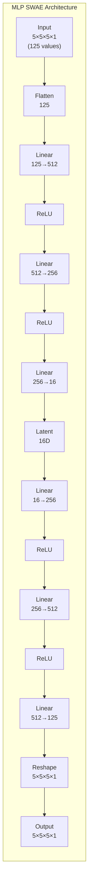
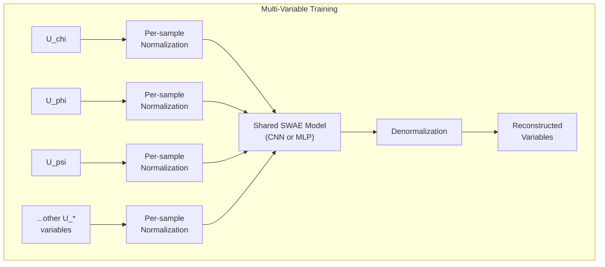

# Neural Network-based Compression with Autoencoders (SWAE)

This repository contains implementations of Sliced Wasserstein Autoencoders (SWAE) for compressing scientific data, specifically focusing on gravitational wave simulation data from the BSSN formalism.

## Overview

The project implements various SWAE architectures to compress 5x5x5 subvolumes of simulation variables. The primary goal is to achieve efficient compression while maintaining high reconstruction quality, enabling fast data transfer across different network interconnects.

## Architecture Implementations

### 1. Initial CNN + Batch Normalization SWAE

The baseline implementation uses a convolutional neural network architecture with batch normalization:

```mermaid
graph TB
    subgraph "CNN SWAE Encoder"
        I["Input<br/>5×5×5×1<br/>(125 values)"] --> C1["Conv3D<br/>3×3×3, 32 ch"]
        C1 --> BN1["BatchNorm3D"] --> R1["ReLU"] --> C2["Conv3D<br/>3×3×3, 64 ch"]
        C2 --> BN2["BatchNorm3D"] --> R2["ReLU"] --> C3["Conv3D<br/>3×3×3, 128 ch"]
        C3 --> BN3["BatchNorm3D"] --> R3["ReLU"] --> C4["Conv3D<br/>3×3×3, 128 ch"]
        C4 --> BN4["BatchNorm3D"] --> R4["ReLU"] --> C5["Conv3D<br/>3×3×3, 256 ch"]
        C5 --> BN5["BatchNorm3D"] --> R5["ReLU"] --> C6["Conv3D<br/>3×3×3, 256 ch"]
        C6 --> BN6["BatchNorm3D"] --> R6["ReLU"] --> C7["Conv3D<br/>3×3×3, 256 ch"]
        C7 --> BN7["BatchNorm3D"] --> R7["ReLU"] --> C8["Conv3D<br/>3×3×3, 256 ch"]
        C8 --> BN8["BatchNorm3D"] --> R8["ReLU"] --> F["Flatten<br/>(2048 values)"]
        F --> FC1["Linear<br/>2048→16"]
        FC1 --> L["Latent Code<br/>16 dimensions"]
    end
```

```mermaid
graph TB
    subgraph "CNN SWAE Decoder"
        L["Latent Code<br/>16 dimensions"] --> FC2["Linear<br/>16→2048"]
        FC2 --> RS["Reshape<br/>2×2×2×256"] --> D1["ConvTranspose3D<br/>2×2×2, 128 ch<br/>stride=2"]
        D1 --> BN9["BatchNorm3D"] --> R9["ReLU"] --> D2["ConvTranspose3D<br/>2×2×2, 64 ch<br/>stride=2"]
        D2 --> BN10["BatchNorm3D"] --> R10["ReLU"] --> D3["ConvTranspose3D<br/>2×2×2, 32 ch<br/>stride=2"]
        D3 --> BN11["BatchNorm3D"] --> R11["ReLU"] --> D4["ConvTranspose3D<br/>2×2×2, 1 ch<br/>stride=2"]
        D4 --> CR["Crop to 5×5×5"] --> O["Output<br/>5×5×5×1<br/>(125 values)"]
    end
```





**Key Features:**
- 8 convolutional layers with progressive channel expansion (32→64→128→256)
- Batch normalization after each convolutional layer
- ReLU activation functions
- Final fully connected layer: 2048 → 16 (latent dimension)
- Total FLOPs: 57,343,552 (Encoder) + 24,902,144 (Decoder)

**Training Script:** `train_swae_u_chi_5x5x5.py` (for U_chi variable only)

### 2. Optimized Network Versions (_opt suffix)

The optimized versions focus on faster inference while maintaining quality:

#### a. Convolutional SWAE (Optimized)

```mermaid
graph TB
    subgraph "Optimized Conv SWAE"
        I2["Input<br/>5×5×5×1"] --> OC1["Conv3D<br/>32 ch"]
        OC1 --> OR1["ReLU"] --> OC2["Conv3D<br/>64 ch"]
        OC2 --> OR2["ReLU"] --> OC3["Conv3D<br/>128 ch"]
        OC3 --> OR3["ReLU"] --> OC4["Conv3D<br/>256 ch"]
        OC4 --> OR4["ReLU"] --> OF["Flatten"]
        OF --> OFC["Linear<br/>2048→16"]
        OFC --> OL["Latent<br/>16D"]
        OL --> OFC2["Linear<br/>16→2048"]
        OFC2 --> ORS["Reshape"] --> OD1["ConvTranspose3D"]
        OD1 --> OR5["ReLU"] --> OD2["ConvTranspose3D"]
        OD2 --> OR6["ReLU"] --> OD3["ConvTranspose3D"]
        OD3 --> OR7["ReLU"] --> OD4["ConvTranspose3D"]
        OD4 --> OO["Output<br/>5×5×5×1"]
    end
```



- Streamlined architecture without batch normalization for faster inference
- Supports INT8 and Float8 quantization for additional speedup
- Maintains the same encoder/decoder structure but optimized for deployment

#### b. MLP SWAE



**MLP Architecture Details:**
- Fully connected architecture for ultra-low latency
- **Encoder:** 125→512→256→16
- **Decoder:** 16→256→512→125
- Total FLOPs: 796,672 (significantly lower than CNN)
- Supports INT8/Float8 quantization for 16x speedup

**Training Scripts:** 
- Files ending with `_opt` (e.g., `train_swae_u_chi_5x5x5_opt.py`)
- Architecture selection via `--arch` parameter: `conv` or `mlp`

### 3. All Variables Model

Extended implementation that handles multiple simulation variables with a single model:



**Supported Variables:** All variables ending with `U_chi` pattern
- Processes multiple physical quantities from gravitational wave simulations
- Uses the same architecture but trained on diverse data distribution
- Maintains per-sample normalization for handling different value ranges

**Training Script:** `train_swae_5x5x5_all_variables.py`
**Inference Script:** `inference_swae_5x5x5_all_variables.py`

## Performance Metrics

### Compression Ratios
- **Input:** 5×5×5 = 125 float32 values (500 bytes)
- **Compressed:** 16 latent dimensions (64 bytes)
- **Compression Ratio:** 7.8:1

### Latency Analysis (from computation_costs.py)

The following table shows total latency (computation + transfer) for different network interconnects:

| Link | TX Raw [μs] | TX Latent [μs] | RAW Total [μs] | Conv SWAE Total [μs] | MLP SWAE FLOAT8 Total [μs] |
|------|-------------|-----------------|----------------|---------------------|---------------------------|
| NVLink 3 (100 GB/s) | 0.04 | 0.0013 | 0.04 | 4.2196 | 0.0048 |
| NVLink 4 (200 GB/s) | 0.02 | 0.0006 | 0.02 | 4.219 | 0.0041 |
| PCIe 4x16 (32 GB/s) | 0.125 | 0.004 | 0.125 | 4.2224 | 0.0075 |
| IB 200 Gb (25 GB/s) | 0.16 | 0.0051 | 0.16 | 4.2235 | 0.0086 |
| Eth 40 Gb (5 GB/s) | 0.8 | 0.0256 | 0.8 | 4.244 | 0.0291 |
| Eth 10 Gb (1.25 GB/s) | 3.2 | 0.1024 | 3.2 | 4.3208 | 0.1059 |
| Eth 1 Gb (0.125 GB/s) | 32.0 | 1.024 | 32.0 | 5.2424 | 1.0275 |

**Key Insights:**
- MLP SWAE with Float8 quantization achieves 875x speedup over Conv SWAE on NVLink
- For slower networks (Ethernet), compression becomes critical for reducing transfer time
- Conv SWAE compute time dominates for fast interconnects, while MLP SWAE is network-bound

## Usage

### Training

1. **Single Variable (U_chi only):**
```bash
sbatch train_swae_u_chi_5x5x5.sbatch
```

2. **All Variables with Optimized Architecture:**
```bash
sbatch train_swae_5x5x5_all_variables.sbatch
```

3. **Custom Architecture Training:**
```bash
python train_swae_5x5x5_all_variables.py \
    --arch mlp \
    --batch-size 64 \
    --epochs 100 \
    --lr 2e-4
```

### Inference

1. **Single Variable Inference:**
```bash
sbatch inference_swae_u_chi_validation_5x5x5.sbatch
```

2. **All Variables Inference:**
```bash
python inference_swae_all_variables_validation_5x5x5_opt.py \
    --model-path ./save/swae_all_vars_5x5x5_opt_mlp/best_model.pth \
    --output-dir results \
    --use-float8  # For Float8 quantization
```

### Compression and Reconstruction

To compress an entire folder of HDF5 files and save both reconstructed data and embeddings:

```bash
./compress_folder.sh
```

This will:
- Process all HDF5 files in `/u/tawal/BSSN-Extracted-Data/tt_q/`
- Generate comparison plots for each variable
- Save `all_variables_reconstructed.h5` with 7x7x7 reconstructed data
- Save `all_variables_encoded.h5` with 16-dimensional latent embeddings
- Create timestamped output directory with all results

### Quantization Options

For MLP architectures, enable faster inference with:
- `--use-float8`: Float8 quantization (16x theoretical speedup with better accuracy than INT8)
  - Available in inference scripts with the `--use-float8` flag
  - Maintains better numerical precision than INT8 while achieving similar speedups
  - Particularly effective for the MLP architecture
- `--enable-int8`: INT8 quantization (16x theoretical speedup)
  - Legacy option for older scripts

Example usage:
```bash
python inference_swae_all_variables_validation_5x5x5_opt.py \
    --model-path ./save/swae_all_vars_5x5x5_opt_mlp/best_model.pth \
    --use-float8 \
    --arch mlp
```

## Architecture Search Experiment

An architecture search experiment is available in:
```
/u/tawal/0722-NN-based-compression-AE/architecture_search_experiment/
```

This directory contains code for systematically exploring different network architectures to find optimal configurations for compression quality vs. speed trade-offs.

## Data Requirements

The models expect HDF5 files containing simulation data with the following structure:
- 3D volumetric data from BSSN simulations
- Variables ending with `U_chi` pattern
- Data is automatically partitioned into 5×5×5 subvolumes during training

## Normalization Methods

Supports multiple normalization strategies:
- `pos_log`: Positive logarithmic transformation (default, handles positive values)
- `minmax`: Min-max normalization to [0, 1]
- `zscore`: Z-score normalization
- `none`: No normalization

## Model Outputs

- **Checkpoint files:** Saved in `./save/` directory
- **Inference results:** 
  - VTI files for visualization in ParaView
  - Comparison plots (normalized and denormalized scales)
  - Comprehensive metrics including PSNR, MSE, and relative errors
- **Speed benchmarks:** Compression/decompression throughput in GB/s

## Key Features

1. **Multi-scale evaluation:** Results shown in both normalized (model scale) and original physical units
2. **Deterministic data splits:** Fixed 80/15/5 train/val/test split with seed=42
3. **Early stopping:** Prevents overfitting with configurable patience
4. **Comprehensive metrics:** PSNR, MSE, correlation, and relative error analysis
5. **Production-ready optimizations:** TF32, mixed precision, and model compilation support

## Directory Structure

```
.
├── README.md                                    # Project documentation
├── compress_folder.sh                           # Script to compress all HDF5 files in a folder
├── compression_and_reconstruction.py            # Inference script with HDF5 output
├── compression_and_reconstruction.sbatch        # SLURM job for compression/reconstruction
├── computation_costs.py                         # Analyzes latency for different network interconnects
├── utils.py                                     # Utility functions
│
├── models/                                      # Model architectures
│   ├── __init__.py
│   ├── models.py                               # Model factory and utilities
│   ├── swae_pure_3d_5x5x5.py                  # CNN SWAE with batch normalization
│   ├── swae_pure_3d_5x5x5_opt.py              # Optimized CNN and MLP SWAE
│   ├── swae_mlp_3d_5x5x5.py                   # MLP-specific implementations
│   ├── swae_log_loss_3d_5x5x5.py              # Log-domain loss variant
│   ├── swae_relative_error_3d_5x5x5.py        # Relative error loss variant
│   └── swae_robust_loss_3d_5x5x5.py           # Robust loss variant
│
├── datasets/                                    # Dataset loaders
│   ├── __init__.py
│   ├── datasets.py                             # Base dataset classes
│   ├── all_variables_dataset_5x5x5_opt.py      # All variables dataset (optimized)
│   ├── u_chi_dataset_5x5x5.py                 # Single variable dataset
│   ├── u_chi_dataset_5x5x5_opt.py             # Single variable dataset (optimized)
│   ├── adaptive_scaling_dataset_5x5x5.py      # Adaptive scaling experiments
│   ├── dual_transform_dataset_5x5x5.py        # Dual transformation experiments
│   └── problematic_variables_dataset_5x5x5.py # Dataset for challenging variables
│
├── train_swae_5x5x5_all_variables.py           # Main training script
├── train_swae_5x5x5_all_variables.sbatch       # SLURM job for training
│
├── inference_swae_all_variables_validation_5x5x5_opt.py    # Validation inference
├── inference_swae_all_variables_validation_5x5x5_opt.sbatch # SLURM job for validation
│
├── save/                                        # Model checkpoints
│   └── swae_all_vars_5x5x5_opt_mlp/           # Pre-trained MLP model
│       └── best_model.pth
│
├── logs/                                        # Training and inference logs
│
├── SWAE-3D-Architecture/                        # Architecture visualization
│   └── swae_architecture_diagram.py            # Generates architecture diagrams
│
├── exact_flops_analysis/                        # Performance analysis
│   ├── calculate_swae_flops.py                 # FLOP calculations
│   └── compression_feasibility_plotter.py      # Feasibility plots
│
└── architecture_search_experiment/              # Architecture search experiments
    ├── train_swae_u_chi.py                     # Base training script
    ├── train_swae_architecture_search.sbatch   # Main architecture search job
    ├── train_swae_arch_search_latent*.sbatch   # Jobs for different latent dimensions
    ├── submit_parallel_arch_search.sh          # Submit all architecture searches
    ├── consolidate_parallel_results.sh         # Gather results
    └── analyze_compression_results.py          # Analyze search results
```

## Key Scripts

### Training
- `train_swae_5x5x5_all_variables.py`: Main training script supporting both CNN and MLP architectures
- `train_swae_5x5x5_all_variables.sbatch`: SLURM submission script

### Inference and Compression
- `compression_and_reconstruction.py`: Process folders of HDF5 files, generate plots and save compressed/reconstructed data
- `compress_folder.sh`: Convenience script to compress all HDF5 files in a folder and save both:
  - `all_variables_reconstructed.h5`: Reconstructed 7x7x7 data in BSSN format
  - `all_variables_encoded.h5`: Compressed latent embeddings (16D vectors)
- `inference_swae_all_variables_validation_5x5x5_opt.py`: Validation with comprehensive metrics

### Analysis
- `computation_costs.py`: Analyze compression performance across different network interconnects
- `exact_flops_analysis/calculate_swae_flops.py`: Detailed FLOP analysis for different architectures

## Citation

If you use this code in your research, please cite the relevant papers on Sliced Wasserstein Autoencoders and the specific application to gravitational wave data compression.