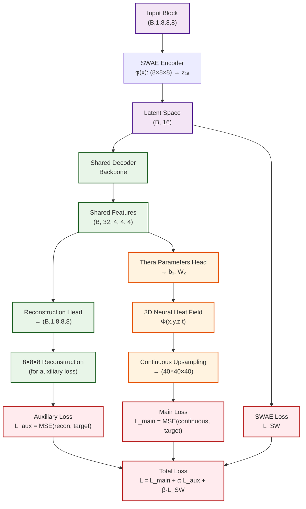

# Neural Network-Based Compression for Scientific Data

A deep learning compression system implementing **Sliced-Wasserstein Autoencoders (SWAE)** for 3D scientific data reconstruction, with plans for continuous upsampling using **Thera Neural Heat Fields**.

## Overview

This project implements a neural network-based compression system specifically designed for 3D scientific simulation data. We have successfully implemented a **pure SWAE (Sliced-Wasserstein Autoencoder)** architecture for reconstructing 3D mathematical functions of the form `sin(2πk₁x)sin(2πk₂y)sin(2πk₃z)` with high fidelity compression.

## Current Implementation: SWAE 3D Architecture

We have implemented a complete SWAE system based on the paper *"Exploring Autoencoder-based Error-bounded Compression for Scientific Data"* with the following architecture:


### Key Features

- **Pure SWAE Implementation**: Block-wise processing of 3D data (8×8×8 blocks)
- **Sliced Wasserstein Distance**: O(n log n) complexity with 50 random projections
- **High Compression Ratio**: ~32:1 compression (512 → 16 dimensions)
- **Mathematical Function Reconstruction**: Specialized for `sin(2πk₁x)sin(2πk₂y)sin(2πk₃z)` functions
- **Proven Architecture**: Based on established research with [32, 64, 128] channel configuration

## Current Results

We have achieved successful reconstruction of 3D mathematical functions with the following performance metrics:

### Sample Results (128×128×128 Resolution)
- **Original data range**: [-0.999771, 0.999771]
- **Reconstructed data range**: [-1.257744, 1.342528]
- **Mean Squared Error (MSE)**: 0.00684822
- **Mean Absolute Error (MAE)**: 0.06383123
- **Peak Signal-to-Noise Ratio (PSNR)**: 21.64 dB
- **Structural Similarity (correlation)**: 0.972412

### Generated Visualizations
- `sample_009_128x128x128_comparison_slices.png`: Comprehensive slice comparison
- `vti_comparison_slices.png`: VTI format visualization
- Detailed axis-wise comparisons and error analysis

## Data Format

The system currently works with:
- **3D Mathematical Functions**: `sin(2πk₁x)sin(2πk₂y)sin(2πk₃z)` with k ∈ {2,3,4,5,6}
- **Volume Size**: 40×40×40 → 128×128×128 (validation)
- **Block Processing**: 8×8×8 blocks (125 blocks per volume)
- **Output Format**: VTI files for scientific visualization

## Next Steps: Thera Integration

We are planning to integrate **Thera Neural Heat Fields** for continuous upsampling, eliminating block assembly artifacts and providing anti-aliased reconstruction at arbitrary resolutions.

### Planned SWAE + Thera Architecture



### Thera Benefits
- **Continuous Reconstruction**: No block assembly artifacts
- **Anti-aliasing Guarantees**: Theoretically grounded upsampling
- **Multi-scale Capability**: Single model for multiple resolutions
- **Thermal Activation**: `ξ(z,ν,κ,t) = sin(z)·exp(-|ν|²κt)` for frequency control

## Future Goals

1. **GR Dataset Testing**: Evaluate SWAE architecture on General Relativity simulation data
2. **Thera Implementation**: Integrate 3D Neural Heat Fields for continuous reconstruction
3. **Multi-scale Evaluation**: Test reconstruction at various resolutions
4. **Performance Optimization**: Improve compression ratios and reconstruction quality

## Project Structure

```
├── models/
│   ├── swae_pure_3d.py          # Pure SWAE 3D implementation
│   ├── swae.py                  # SWAE with LIIF integration
│   ├── thera_3d.py              # 3D Thera neural heat fields
│   └── liif_3d.py               # 3D LIIF framework
├── datasets/
│   ├── math_function_3d.py      # 3D mathematical function dataset
│   └── swae_3d_dataset.py       # SWAE-specific dataset wrapper
├── configs/
│   └── train-3d/               # Training configurations
├── validation_128_inference_results/  # 128³ validation results
├── validation_inference_results/      # 40³ validation results
├── train_swae_3d_pure.py        # Pure SWAE training script
└── inference_swae_3d_128_validation.py  # Validation inference
```

## Installation

```bash
# Clone the repository
git clone https://github.com/tahmidawal/NN-based-Compression-for-Scientific-Data.git
cd NN-based-Compression-for-Scientific-Data

# Install dependencies
pip install torch torchvision torchaudio
pip install vtk matplotlib numpy pyyaml
```

## Usage

### Training SWAE Model

```bash
python train_swae_3d_pure.py --config configs/train-3d/train_swae_thera_3d.yaml
```

### Running Inference

```bash
python inference_swae_3d_128_validation.py --model_path save/swae_3d_model.pth
```

### Generating Comparisons

```bash
cd validation_128_inference_results
python compare_vti_slices.py
```

## Technical Specifications

- **Framework**: PyTorch
- **Input Resolution**: 40×40×40 → 128×128×128
- **Block Size**: 8×8×8 (as per SWAE paper Table VI)
- **Latent Dimension**: 16
- **Architecture Channels**: [32, 64, 128]
- **Compression Ratio**: ~32:1
- **Loss Components**: Reconstruction + Sliced Wasserstein (λ=10.0)

## Research Foundation

This implementation is based on:
1. **"Exploring Autoencoder-based Error-bounded Compression for Scientific Data"** - SWAE architecture
2. **"Thera: Aliasing-Free Arbitrary-Scale Super-Resolution with Neural Heat Fields"** - Continuous upsampling (planned)
3. **"Learning Continuous Image Representation with Local Implicit Image Function"** - LIIF framework integration

## Contributing

This is an active research project. Contributions and suggestions for improving 3D scientific data compression are welcome!

## License

[Add your license here]

---

**Status**: ✅ SWAE Implementation Complete | 🚧 Thera Integration In Progress | 📋 GR Dataset Testing Planned
