# Neural Network-Based Compression for Scientific Data

A deep learning compression system implementing **Sliced-Wasserstein Autoencoders (SWAE)** for 3D scientific data reconstruction, with plans for continuous upsampling using **Thera Neural Heat Fields**.

## 🎉 BREAKTHROUGH UPDATE - June 2025

**Major Success**: We've achieved **4× improvement in PSNR** (3.6 dB → 14.6 dB) and **2× improvement in correlation** (0.41 → 0.857) for U_CHI scientific data compression through innovative **log-scale preprocessing**! The system now delivers high-quality reconstruction with 21.4:1 compression ratio.

## Overview

This project implements a neural network-based compression system specifically designed for 3D scientific simulation data. We have successfully implemented a **pure SWAE (Sliced-Wasserstein Autoencoder)** architecture for reconstructing 3D mathematical functions of the form `sin(2πk₁x)sin(2πk₂y)sin(2πk₃z)` with high fidelity compression.

**Current Status**: ✅ **MAJOR BREAKTHROUGH ACHIEVED** - Successfully adapted SWAE architecture for **U_CHI variable data** from GR (General Relativity) simulation datasets with outstanding reconstruction quality improvements through log-scale transformation.

## Current Implementation: SWAE 3D Architecture

We have implemented a complete SWAE system based on the paper *"Exploring Autoencoder-based Error-bounded Compression for Scientific Data"* with **two specialized architectures**:

### 🔬 **NEW: 7×7×7 U_CHI Architecture (Current Focus)**

The breakthrough results were achieved using our **optimized 7×7×7 SWAE architecture** specifically designed for U_CHI General Relativity simulation data:

```mermaid
graph TD
  %% Input Processing
  subgraph Input_Processing ["🔄 Log-Scale Preprocessing"]
    direction TB
    A["U_CHI Raw Data<br/>(7×7×7)<br/>High Dynamic Range"]
    B["Positive-Shift Transform<br/>data_shifted = data - min + ε<br/>log_data = log(data_shifted)"]
    C["Normalized Input<br/>(B,1,7,7,7)<br/>Reduced Dynamic Range"]
    A --> B --> C
  end

  %% Encoder Architecture
  subgraph Encoder_7x7x7 ["🔍 SWAE 7×7×7 Encoder"]
    direction TB
    D["Conv3D Block 1<br/>1→32 ch, k=3, s=2, p=1<br/>Conv3D + Conv3D + BN + ReLU<br/>7×7×7 → 4×4×4"]
    E["Conv3D Block 2<br/>32→64 ch, k=3, s=2, p=1<br/>Conv3D + Conv3D + BN + ReLU<br/>4×4×4 → 2×2×2"]
    F["Conv3D Block 3<br/>64→128 ch, k=3, s=2, p=1<br/>Conv3D + Conv3D + BN + ReLU<br/>2×2×2 → 1×1×1"]
    G["Flatten + FC<br/>128 → 16<br/>Latent Space"]
    D --> E --> F --> G
  end

  %% Latent Space & SW Distance
  subgraph Latent_Space ["⚡ Latent Space + Sliced Wasserstein"]
    direction TB
    H["Latent Code z<br/>(B, 16)<br/>21.4:1 Compression"]
    I["Prior Samples<br/>N(0, I)<br/>Standard Normal"]
    J["SW Distance<br/>50 projections<br/>λ = 0.9"]
    H --> J
    I --> J
  end

  %% Decoder Architecture
  subgraph Decoder_7x7x7 ["🔧 SWAE 7×7×7 Decoder"]
    direction TB
    K["FC + Reshape<br/>16 → 128<br/>→ (128,1,1,1)"]
    L["DeConv3D Block 1<br/>128→64 ch, k=3, s=2, p=1<br/>ConvTranspose3D + Conv3D + BN + ReLU<br/>1×1×1 → 2×2×2"]
    M["DeConv3D Block 2<br/>64→32 ch, k=3, s=2, p=1<br/>ConvTranspose3D + Conv3D + BN + ReLU<br/>2×2×2 → 4×4×4"]
    N["Final DeConv3D<br/>32→1 ch, k=4, s=1, p=0<br/>ConvTranspose3D (no activation)<br/>4×4×4 → 7×7×7"]
    K --> L --> M --> N
  end

  %% Output Processing
  subgraph Output_Processing ["🔄 Inverse Log-Scale Processing"]
    direction TB
    O["Reconstructed Log<br/>(B,1,7,7,7)<br/>Log-Scale Domain"]
    P["Inverse Transform<br/>recovered = exp(log_data) - ε + min<br/>Perfect Round-trip"]
    Q["Final Output<br/>(7×7×7)<br/>Original Scale"]
    O --> P --> Q
  end

  %% Loss Function
  subgraph Loss_Function ["📊 SWAE Loss"]
    direction TB
    R["Reconstruction Loss<br/>MSE(original, recovered)<br/>In original scale"]
    S["SW Regularization<br/>λ × SW_distance<br/>λ = 0.9"]
    T["Total Loss<br/>L = L_recon + λ × L_SW"]
    R --> T
    S --> T
  end

  %% Flow connections
  Input_Processing --> Encoder_7x7x7 --> Latent_Space --> Decoder_7x7x7 --> Output_Processing
  Latent_Space --> Loss_Function
  Input_Processing --> Loss_Function
  Output_Processing --> Loss_Function

  %% Styling
  classDef preprocessing fill:#e3f2fd,stroke:#1976d2,stroke-width:2px,color:#000
  classDef encoder fill:#f3e5f5,stroke:#7b1fa2,stroke-width:2px,color:#000
  classDef latent fill:#fff3e0,stroke:#f57c00,stroke-width:3px,color:#000
  classDef decoder fill:#e8f5e8,stroke:#388e3c,stroke-width:2px,color:#000
  classDef postprocessing fill:#e8eaf6,stroke:#3f51b5,stroke-width:2px,color:#000
  classDef loss fill:#ffebee,stroke:#d32f2f,stroke-width:2px,color:#000

  class A,B,C preprocessing
  class D,E,F,G encoder
  class H,I,J latent
  class K,L,M,N decoder
  class O,P,Q postprocessing
  class R,S,T loss
```



#### **Key Architectural Features of 7×7×7 SWAE:**

- **📐 Input Size**: 7×7×7 blocks (343 values → 16 latent dimensions)
- **🔄 Log-Scale Processing**: Positive-shift method for dynamic range reduction
- **🏗️ Encoder**: 3 Conv3D blocks with [32, 64, 128] channels
- **⚡ Latent Space**: 16-dimensional with 21.4:1 compression ratio
- **🔧 Decoder**: Custom architecture with exact 7×7×7 reconstruction
- **🎯 Final Layer**: ConvTranspose3D(k=4, s=1, p=0) for precise dimension matching
- **📊 Loss**: Reconstruction (original scale) + Sliced Wasserstein (λ=0.9)

### 📊 **Original: 8×8×8 Mathematical Functions Architecture**

Our initial implementation for mathematical function reconstruction:
graph LR
  %% Input Data
  subgraph Input_Data ["Input Data"]
    direction TB
    A["3D Scientific Data<br/>(40×40×40)"]
    B["Block Partitioning<br/>(8×8×8)"]
    C["Input Block<br/>(B,1,8,8,8)"]
    A --> B --> C
  end

  %% Encoder
  subgraph Encoder ["SWAE Encoder"]
    direction TB
    D["Conv3D Block 1<br/>1→32 ch, s=2<br/>4×4×4"]
    E["Conv3D Block 2<br/>32→64 ch, s=2<br/>2×2×2"]
    F["Conv3D Block 3<br/>64→128 ch, s=2<br/>1×1×1"]
    G["FC Layer<br/>128→16"]
    D --> E --> F --> G
  end

  %% Latent Space
  subgraph Latent ["Latent Space"]
    H["Compressed Code<br/>(B, 16)<br/>~32:1 compression"]
  end

  %% Decoder
  subgraph Decoder ["SWAE Decoder"]
    direction TB
    I["FC + Reshape<br/>16→128"]
    J["DeConv3D Block 1<br/>128→64 ch, s=2<br/>2×2×2"]
    K["DeConv3D Block 2<br/>64→32 ch, s=2<br/>4×4×4"]
    L["DeConv3D Block 3<br/>32→1 ch, s=2<br/>8×8×8"]
    I --> J --> K --> L
  end

  %% Loss Function
  subgraph Loss ["SWAE Loss Function"]
    direction TB
    M["Reconstruction Loss<br/>L_recon = MSE(x, x̂)"]
    N["Sliced Wasserstein Distance<br/>L_SW = SW(z, z_prior)"]
    O["Total Loss<br/>L = L_recon + λ·L_SW<br/>λ = 1.0 (adjusted)"]
    M --> O
    N --> O
  end

  %% Output
  subgraph Output ["Output"]
    direction TB
    P["Reconstructed Blocks<br/>(B,1,8,8,8)"]
    Q["Block Assembly<br/>125 blocks → 40×40×40"]
    R["Final Reconstruction<br/>(40×40×40)"]
    P --> Q --> R
  end

  %% Inter-subgraph connections
  Input_Data --> Encoder --> Latent --> Decoder --> Loss --> Output
```

### Key Features

- **Pure SWAE Implementation**: Block-wise processing of 3D data (8×8×8 blocks)
- **Sliced Wasserstein Distance**: O(n log n) complexity with 50 random projections
- **High Compression Ratio**: ~32:1 compression (512 → 16 dimensions)
- **Mathematical Function Reconstruction**: Specialized for `sin(2πk₁x)sin(2πk₂y)sin(2πk₃z)` functions
- **Proven Architecture**: Based on established research with [32, 64, 128] channel configuration

## U_CHI Dataset Implementation

### Dataset Characteristics
- **Source**: GR simulation HDF5 files containing U_CHI variable data
- **Block Size**: 7×7×7 (adapted from original 8×8×8)
- **Data Shape**: (num_samples, 1, 7, 7, 7)
- **Value Range**: Normalized between 0 and 1
- **Variability**: High dynamic range with significant spatial variations

### Current Issues Identified
1. **Poor Reconstruction Quality**: PSNR remains low (~3-6 dB) despite low MSE
2. **Data Variability**: Unnecessary complexity in the data distribution
3. **Architectural Mismatch**: 7×7×7 input with 8×8×8 decoder output requiring cropping
4. **Regularization Impact**: High lambda_reg (10.0) was causing over-regularization

### Recent Improvements
- **Reduced Regularization**: λ_reg adjusted from 10.0 to 1.0
- **Enhanced Monitoring**: Added latent space range and correlation tracking
- **Improved Inference**: VTI file generation and detailed slice comparisons
- **Batch Size Optimization**: Increased to 64 for better training stability

## Current Results

### Mathematical Function Results (128×128×128 Resolution)
- **Original data range**: [-0.999771, 0.999771]
- **Reconstructed data range**: [-1.257744, 1.342528]
- **Mean Squared Error (MSE)**: 0.00684822
- **Mean Absolute Error (MAE)**: 0.06383123
- **Peak Signal-to-Noise Ratio (PSNR)**: 21.64 dB
- **Structural Similarity (correlation)**: 0.972412

### U_CHI Dataset Results - BREAKTHROUGH IMPROVEMENTS! 🎉

#### Latest Results with Log-Scale Preprocessing (June 2025)
- **Mean Squared Error (MSE)**: 6.34 × 10⁻⁵ (99% improvement!)
- **Peak Signal-to-Noise Ratio (PSNR)**: **14.62 dB** (4× improvement from 3.6 dB)
- **Mean Absolute Error (MAE)**: 0.0068 (80% improvement)
- **Structural Similarity (correlation)**: **0.857** (2.1× improvement from 0.41)
- **Compression Ratio**: 21.4:1 (343 → 16-dimensional latent space)
- **Model Configuration**: latent_dim=16, λ_reg=0.9

#### Key Breakthrough: Positive-Shift Log-Scale Transformation
```python
# Applied preprocessing that solved the reconstruction issues
def log_scale_transform(data, epsilon=1e-8, method='positive_shift'):
    data_min = data.min()
    data_shifted = data - data_min + epsilon
    log_data = np.log(data_shifted + epsilon)
    return log_data, {'data_min': data_min, 'epsilon': epsilon}
```

#### Previous Results (Before Log-Scale)
- **Validation PSNR**: ~3.6 dB 
- **Correlation**: 0.41
- **Issue**: Poor reconstruction quality due to high dynamic range

#### Improvement Summary
| Metric | Before | After | Improvement |
|--------|--------|-------|-------------|
| PSNR | 3.6 dB | **14.6 dB** | **+305%** |
| Correlation | 0.41 | **0.857** | **+109%** |
| MSE | 0.0015 | **6.34×10⁻⁵** | **-96%** |
| MAE | 0.033 | **0.0068** | **-79%** |

#### Visual Results & Analysis

The log-scale preprocessing has yielded significant improvements, but detailed analysis reveals **performance variations across different data ranges**:


*Sample 006: Normalized comparison showing good reconstruction in mid-range values*


*Sample 009: Normalized comparison revealing challenges in extreme value ranges*

#### 🔍 Key Observations & Remaining Challenges

**Performance Variability Across Data Ranges**:
- **✅ Strong performance**: Mid-range and typical values show excellent reconstruction
- **⚠️ Inconsistent performance**: Extreme values and edge cases still show reconstruction artifacts
- **📊 Range dependency**: Model performance correlates with data magnitude and local variability

**Areas Requiring Further Work**:
1. **Adaptive preprocessing**: Different regions may benefit from tailored log-scale parameters
2. **Multi-scale training**: Incorporate samples across full dynamic range during training
3. **Loss function refinement**: Weight reconstruction errors based on data significance
4. **Regularization tuning**: Balance between compression and fidelity across value ranges

## Implemented Solutions & Future Improvements

### 1. ✅ Log-Scale Processing - IMPLEMENTED & SUCCESSFUL!
**Problem**: High data variability causing reconstruction difficulties  
**Solution**: ✅ **SOLVED** - Applied positive-shift log-scale transformation with outstanding results

#### Implementation Details
```python
# IMPLEMENTED: Successful log-scale preprocessing
def log_scale_transform(data, epsilon=1e-8, method='positive_shift'):
    """Apply positive-shift log-scale transformation - PROVEN EFFECTIVE"""
    data_min = data.min()
    data_shifted = data - data_min + epsilon
    log_data = np.log(data_shifted + epsilon)
    transform_params = {'data_min': data_min, 'epsilon': epsilon}
    return log_data, transform_params

def inverse_log_scale_transform(log_data, transform_params, method='positive_shift'):
    """Inverse transformation with perfect round-trip fidelity"""
    data_min = transform_params['data_min']
    epsilon = transform_params['epsilon']
    recovered_data = np.exp(log_data) - epsilon + data_min
    return recovered_data
```

#### Validation Results from Log-Scale Analysis
- **Round-trip PSNR**: 100+ dB (near-perfect reconstruction)
- **Correlation**: 0.999999+ (excellent preservation)
- **Relative Error**: <0.01% (minimal information loss)
- **Method Comparison**: Positive-shift outperformed symlog and abs_log methods

### 2. Thera Integration
**Problem**: Block-based reconstruction with assembly artifacts
**Solution**: Integrate Thera Neural Heat Fields for continuous reconstruction

### Planned SWAE + Thera Architecture

```mermaid
graph TD
    A["Input Block<br/>(B,1,7,7,7)"] --> B["SWAE Encoder<br/>φ(x): (7×7×7) → z₁₆"]
    B --> C["Latent Space<br/>(B, 16)"]
    C --> D["Shared Decoder<br/>Backbone"]
    D --> E["Shared Features<br/>(B, 32, 4, 4, 4)"]
    
    E --> F["Reconstruction Head<br/>→ (B,1,7,7,7)"]
    E --> G["Thera Parameters Head<br/>→ b₁, W₂"]
    
    F --> H["7×7×7 Reconstruction<br/>(for auxiliary loss)"]
    G --> I["3D Neural Heat Field<br/>Φ(x,y,z,t)"]
    I --> J["Continuous Upsampling<br/>→ (40×40×40)"]
    
    %% Loss connections
    H --> K["Auxiliary Loss<br/>L_aux = MSE(recon, target)"]
    J --> L["Main Loss<br/>L_main = MSE(continuous, target)"]
    C --> M["SWAE Loss<br/>L_SW"]
    
    K --> N["Total Loss<br/>L = L_main + α·L_aux + β·L_SW"]
    L --> N
    M --> N
    
    classDef encoder fill:#f3e5f5,stroke:#4a148c,stroke-width:2px
    classDef decoder fill:#e8f5e8,stroke:#1b5e20,stroke-width:2px
    classDef thera fill:#fff3e0,stroke:#e65100,stroke-width:2px
    classDef loss fill:#ffebee,stroke:#b71c1c,stroke-width:2px
    
    class A,C encoder
    class D,E,F,H decoder
    class G,I,J thera
    class K,L,M,N loss
```



### Thera Benefits
- **Continuous Reconstruction**: No block assembly artifacts
- **Anti-aliasing Guarantees**: Theoretically grounded upsampling
- **Multi-scale Capability**: Single model for multiple resolutions
- **Thermal Activation**: `ξ(z,ν,κ,t) = sin(z)·exp(-|ν|²κt)` for frequency control

### 3. Architectural Refinements
- **Consistent Block Sizes**: Align encoder/decoder for 7×7×7 throughout
- **Improved Loss Functions**: Consider perceptual losses or SSIM
- **Data Augmentation**: Rotation, scaling for better generalization

## Data Format

The system currently works with:
- **3D Mathematical Functions**: `sin(2πk₁x)sin(2πk₂y)sin(2πk₃z)` with k ∈ {2,3,4,5,6}
- **U_CHI GR Data**: 7×7×7 blocks from HDF5 simulation files
- **Volume Size**: 40×40×40 → 128×128×128 (validation)
- **Block Processing**: 7×7×7 blocks (adapted from 8×8×8)
- **Output Format**: VTI files for scientific visualization

## Key Achievements & Future Goals

### 🏆 Major Breakthroughs Accomplished

#### ✅ SWAE 3D Architecture Successfully Implemented
- Pure SWAE implementation with sliced Wasserstein distance
- Proven architecture: [32, 64, 128] channels, 16D latent space
- 21.4:1 compression ratio achieved

#### ✅ Log-Scale Preprocessing Revolution
- **4× PSNR improvement**: 3.6 dB → 14.6 dB
- **2× correlation improvement**: 0.41 → 0.857
- **96% MSE reduction**: Near-perfect data preservation
- Positive-shift method proven superior to alternatives

#### ✅ Scientific Data Compatibility
- Successfully adapted for 7×7×7 U_CHI GR simulation data
- VTI output format for scientific visualization
- Error-bounded compression suitable for scientific computing

### 🚀 Next Steps & Future Goals

1. **✅ Log-Scale Implementation**: **COMPLETED** - Outstanding results achieved
2. **🔧 Range-Adaptive Processing**: Address performance variations across data ranges
   - Implement adaptive preprocessing for different value ranges
   - Develop range-aware loss functions and training strategies
3. **🔄 Thera Integration**: Continuous reconstruction without block artifacts
4. **📊 Multi-scale Evaluation**: Test reconstruction at various resolutions
5. **🎯 Production Deployment**: Scale to full-size scientific datasets
6. **📈 Performance Optimization**: Further architectural improvements for edge cases

## 📁 Repository Structure & Data Management

### ✅ **Files Included in Git Repository**
- **Source Code**: All Python scripts, models, and utilities
- **Configuration Files**: YAML configs, SLURM batch scripts
- **Documentation**: README, markdown files, architecture diagrams  
- **Analysis Results**: PNG images, visualization plots, metrics
- **Small Data Files**: VTI files for visualization (< 10MB each)

### 🚫 **Files Excluded from Repository** (619MB+ total)
**Excluded by `.gitignore` to keep repository manageable:**

#### **Large Model Files** (615MB)
- `save/swae_u_chi_poslog_corrected_20250624_200538/`
  - `final_model.pth` (15MB) - **Best trained model with 14.6 dB PSNR**
  - `best_model.pth` (15MB) - Top performing checkpoint
  - 40+ training checkpoints (15MB each) - Every 25 epochs
  - Training logs and metrics

#### **Data Files** 
- `logscale_val_inference/*.hdf5` - 20 validation data samples
- `logs/` - Training logs and tensorboard files (1.6MB)
- Cache directories: `__pycache__/`, `models/__pycache__/`

#### **File Types Excluded**
- `*.pth` - PyTorch model checkpoints
- `*.hdf5` - HDF5 scientific data files
- `*.pkl`, `*.joblib` - Serialized objects
- `*.log`, `*.out`, `*.err` - Log files
- `*.npy`, `*.npz` - NumPy arrays

**Note**: The trained models achieving **14.6 dB PSNR breakthrough** are stored locally in `save/` directory. Contact repository owner for access to trained model weights.
4. **Performance Optimization**: Improve compression ratios and reconstruction quality
5. **GR Dataset Optimization**: Fine-tune for U_CHI variable characteristics

## Project Structure

```
├── models/
│   ├── swae_pure_3d.py          # Pure SWAE 3D implementation
│   ├── swae_pure_3d_7x7x7.py    # 7×7×7 adapted SWAE
│   ├── swae.py                  # SWAE with LIIF integration
│   ├── thera_3d.py              # 3D Thera neural heat fields
│   └── liif_3d.py               # 3D LIIF framework
├── datasets/
│   ├── math_function_3d.py      # 3D mathematical function dataset
│   ├── u_chi_dataset.py         # U_CHI GR dataset implementation
│   └── swae_3d_dataset.py       # SWAE-specific dataset wrapper
├── configs/
│   └── train-3d/               # Training configurations
├── validation_128_inference_results/  # 128³ validation results
├── validation_inference_results/      # 40³ validation results
├── validation_u_chi_results_*/        # U_CHI validation results
├── train_swae_3d_pure.py        # Pure SWAE training script
├── train_swae_u_chi.py          # U_CHI dataset training
└── inference_swae_u_chi_validation.py  # U_CHI validation inference
```

## Installation

```bash
# Clone the repository
git clone https://github.com/tahmidawal/NN-based-Compression-for-Scientific-Data.git
cd NN-based-Compression-for-Scientific-Data

# Install dependencies
pip install torch torchvision torchaudio
pip install vtk matplotlib numpy pyyaml h5py
```

## Usage

### Training SWAE Model (Mathematical Functions)

```bash
python train_swae_3d_pure.py --config configs/train-3d/train_swae_thera_3d.yaml
```

### Training SWAE Model (U_CHI Dataset)

```bash
python train_swae_u_chi.py --config configs/train-3d/train_swae_thera_3d.yaml
```

### Running Inference

```bash
python inference_swae_3d_128_validation.py --model_path save/swae_3d_model.pth
python inference_swae_u_chi_validation.py --model_path save/swae_u_chi_model.pth
```

## Current Status

- ✅ **Mathematical Function SWAE**: Fully implemented and working
- ✅ **U_CHI Dataset**: Implemented and training
- 🔄 **Reconstruction Quality**: Needs improvement (log-scale + Thera)
- 🔄 **Thera Integration**: Planned for continuous reconstruction
- 🔄 **Log-Scale Processing**: Proposed for data variability reduction

## Technical Specifications

- **Framework**: PyTorch
- **Input Resolution**: 40×40×40 → 128×128×128
- **Block Size**: 8×8×8 (as per SWAE paper Table VI)
- **Latent Dimension**: 16
- **Architecture Channels**: [32, 64, 128]
- **Compression Ratio**: ~32:1
- **Loss Components**: Reconstruction + Sliced Wasserstein (λ=10.0)

## Research Foundation

This implementation is based on:
1. **"Exploring Autoencoder-based Error-bounded Compression for Scientific Data"** - SWAE architecture
2. **"Thera: Aliasing-Free Arbitrary-Scale Super-Resolution with Neural Heat Fields"** - Continuous upsampling (planned)
3. **"Learning Continuous Image Representation with Local Implicit Image Function"** - LIIF framework integration

## Contributing

This is an active research project. Contributions and suggestions for improving 3D scientific data compression are welcome!

## License

[Add your license here]

---

**Status**: ✅ SWAE Implementation Complete | 🚧 Thera Integration In Progress | 📋 GR Dataset Testing Planned
